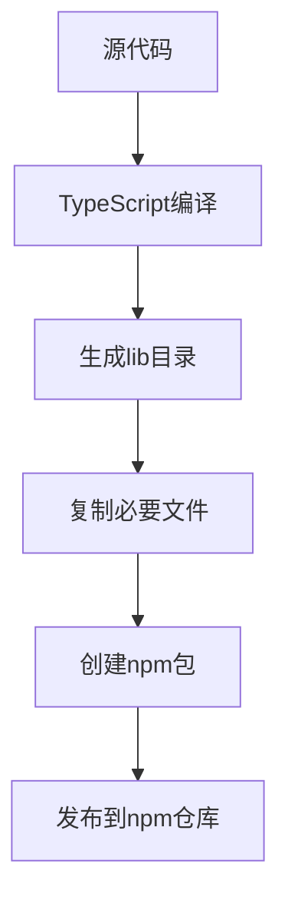

# Jimeng MCP 可独立安装包设计方案

## 1. 概述

本设计方案旨在将 Jimeng MCP 项目打包成可独立安装的包，使用户能够在不依赖源代码的情况下安装和使用该服务。Jimeng MCP 是一个基于 TypeScript 实现的 Model Context Protocol (MCP) 服务器，集成了即梦AI图像和视频生成服务。

## 2. 系统架构

### 2.1 项目结构
```
jimeng-mcp/
├── lib/                    # 编译后的JavaScript文件
├── package.json           # 包配置文件
├── README.md              # 使用说明
├── LICENSE                # 许可证
└── .env.example          # 环境变量示例文件
```

### 2.2 核心组件
- **MCP服务器**: 基于@modelcontextprotocol/sdk实现的标准MCP服务器
- **即梦AI客户端**: 封装了即梦AI图像和视频生成API的客户端
- **HTTP API服务**: 可选的Express服务，提供HTTP接口调用方式
- **CLI工具**: 命令行接口，支持多种启动模式

## 3. 打包策略

### 3.1 构建流程


### 3.2 文件包含策略
- **必须包含**:
  - 编译后的JavaScript文件(lib/)
  - package.json
  - README.md
  - LICENSE
  - .env.example
  
- **排除**:
  - 源代码(src/)
  - 开发依赖
  - 测试文件
  - 配置文件(tsconfig.json, tsup.config.ts)

### 3.3 依赖处理
- **生产依赖**: 全部包含在打包中
  - @modelcontextprotocol/sdk
  - axios
  - crypto-js
  - dotenv
  - express
  - uuid
  - zod
  - @types/crypto-js
  - crc32

## 4. 安装方式

### 4.1 npm/yarn 安装
```bash
# 全局安装
npm install -g jimeng-mcp
# 或
yarn global add jimeng-mcp
```

### 4.2 npx 直接运行
```bash
npx jimeng-mcp
```

### 4.3 Docker 部署
```bash
docker run -it --env JIMENG_API_TOKEN=your_token jimeng-mcp
```

## 5. 使用方式

### 5.1 MCP模式启动
```bash
jimeng-mcp
# 或指定环境变量
JIMENG_API_TOKEN=your_token jimeng-mcp
```

### 5.2 API服务模式启动
```bash
jimeng-mcp-api
# 或
jimeng-mcp --api
```

### 5.3 CLI参数
```bash
# 查看帮助信息
jimeng-mcp --help

# 指定端口启动API服务
jimeng-mcp-api --port 8080

# 指定环境变量文件
jimeng-mcp --env-file .env.production
```

### 5.3 环境变量配置
在使用前需要配置环境变量:
```bash
# 复制示例配置
cp .env.example .env
# 编辑.env文件，填入即梦API令牌
```

## 6. API 接口设计

### 6.1 图像生成接口
- **Endpoint**: POST /generateImage
- **Parameters**:
  - prompt: 生成图像的文本描述
  - filePath: 参考图片路径(可选)
  - model: 模型名称(可选)
  - width: 图像宽度(可选)
  - height: 图像高度(可选)
  - sample_strength: 精细度(可选)
  - negative_prompt: 反向提示词(可选)

### 6.2 视频生成接口
- **Endpoint**: POST /generateVideo
- **Parameters**:
  - prompt: 生成视频的文本描述
  - filePath: 首尾帧图片路径(可选)
  - model: 模型名称(可选)
  - resolution: 分辨率(可选)
  - width: 视频宽度(可选)
  - height: 视频高度(可选)

## 7. 打包配置

### 7.1 package.json 配置
```json
{
  "name": "jimeng-mcp",
  "version": "1.9.0",
  "description": "MCP服务器项目，集成即梦AI图像生成",
  "main": "lib/index.js",
  "types": "lib/index.d.ts",
  "bin": {
    "jimeng-mcp": "lib/index.js",
    "jimeng-mcp-api": "lib/script/start.js"
  },
  "files": [
    "lib",
    ".env.example",
    "README.md",
    "LICENSE"
  ],
  "scripts": {
    "start": "node -r dotenv/config lib/index.js",
    "start:api": "dotenv -e .env -- node lib/script/start.js"
  }
}
```

### 7.2 构建脚本
```bash
# 构建生产代码
yarn build
```

## 8. 部署方案

### 8.1 本地部署
1. 安装Node.js (版本14.0+)
2. 全局安装包: `npm install -g jimeng-mcp`
3. 配置环境变量
4. 启动服务: `jimeng-mcp`

### 8.2 云服务器部署
1. 在云服务器上安装Node.js
2. 安装包: `npm install -g jimeng-mcp`
3. 配置环境变量
4. 使用进程管理器(pm2)运行:
   ```bash
   pm2 start jimeng-mcp
   ```

### 8.3 Docker部署
```dockerfile
FROM node:lts-alpine
WORKDIR /app
COPY . .
RUN npm install --production
EXPOSE 3000
CMD ["jimeng-mcp"]
```

## 9. 版本管理

### 9.1 版本策略
- 遵循语义化版本控制(SemVer)
- 主版本号: 重大功能更新或不兼容的API更改
- 次版本号: 向后兼容的功能新增
- 修订号: 向后兼容的问题修复

### 9.2 发布流程
1. 更新版本号
2. 构建生产包
3. 发布到npm仓库
4. 更新CHANGELOG.md
5. 创建GitHub Release

### 9.3 CI/CD流程
- 自动化测试
- 自动化构建
- 自动发布到npm
- Docker镜像构建和推送

## 10. 安全考虑

### 10.1 环境变量保护
- 敏感信息通过环境变量配置
- 不在代码中硬编码API密钥
- 提供.env.example模板文件

### 10.2 依赖安全
- 定期更新依赖包
- 使用npm audit检查安全漏洞
- 只包含必要的生产依赖

## 11. 测试策略

### 11.1 单元测试
- 对核心API客户端进行单元测试
- 测试图像和视频生成功能
- 验证参数验证逻辑

### 11.2 集成测试
- 测试与即梦API的集成
- 验证MCP协议通信
- 测试HTTP API接口

## 12. 性能优化

### 12.1 构建优化
- 使用tsup进行代码编译和打包
- 生成source map便于调试
- 支持CommonJS和ESM格式

### 12.2 运行时优化
- 连接池管理
- 请求缓存
- 错误重试机制